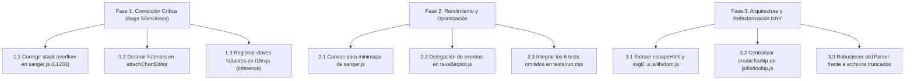

# Informe de Auditoría Global de Software: Smart-175
**Rol:** Ingeniero de Software Principal  
**Fecha:** 15 de Septiembre de 2026  
**Alcance:** Análisis estático, arquitectura, rendimiento (DOM/memoria), suite de pruebas, resiliencia y sistema de internacionalización (i18n).  
**Estado:** Diagnóstico completado — código fuente intacto.

---

## Resumen Ejecutivo

Se ha ejecutado un barrido exhaustivo sobre el 100% de la base de código de **Smart-175** (más de 70 archivos JavaScript/CSS y 35 suites de tests). El proyecto destaca por una base sólida y principios encomiables: cómputo 100% en cliente sin servidores, arquitectura desacoplada por módulos y ausencia de dependencias externas pesadas.

Sin embargo, el crecimiento rápido de funcionalidades ha introducido **deuda técnica acumulada**, **fugas silenciosas de event listeners en `document`**, **riesgo de desbordamiento de pila (Call Stack Overflow) en cromatogramas densos**, y **patrones anti-DRY** con código duplicado hasta en 19 archivos.

A continuación se desglosan los hallazgos categorizados por impacto y prioridad de acción.

---

## 🔴 Crítico (Acción Inmediata): Bugs Silenciosos y Cuellos de Botella Graves

### 1. Fuga Sistemática de Event Listeners Globales en `attachChartEditor`
* **Archivos Afectados:** `js/modules/sanger.js` (L2225), `js/modules/betaDiversity.js` (L432, L639), `js/modules/alphaDiversity.js` (L238, L535), `js/modules/correlogram.js` (L524, L686), entre otros.
* **Diagnóstico:** Cada llamada a `attachChartEditor` registra listeners permanentes en el objeto raíz del DOM:
  ```javascript
  document.addEventListener('pointerdown', onDocDown, true);
  document.addEventListener('keydown', onKey);
  ```
  En `sanger.js`, `attachChartEditor` se invoca dentro de `paintCromatograma()` sin capturar el objeto retornado ni llamar a su método `destroy()`. En otros módulos (`betaDiversity`, `alphaDiversity`), al alternar entre sub-pestañas (Heatmap ↔ PCoA, Boxplot ↔ Rarefacción), la variable `editor` se sobreescribe sin destruir la anterior.
* **Impacto:** Fuga de memoria progresiva (listeners zombis que nunca se desenganchan) y degradación de rendimiento en eventos globales de teclado y puntero durante sesiones de uso prolongadas.
* **Solución:** Guardar siempre la referencia del editor activo, invocar `if (editor) editor.destroy()` antes de re-renderizar y asegurar su destrucción en la función de limpieza que retorna `render(container)`.

### 2. Riesgo de `RangeError: Maximum call stack size exceeded` en Trazas Sanger
* **Archivo Afectado:** `js/modules/sanger.js` (L1203)
* **Diagnóstico:**
  ```javascript
  maxIntensity = Math.max(1, ...['A', 'C', 'G', 'T'].flatMap((b) => [Math.max(...read.trace[b])]));
  ```
  Los archivos de electroforesis capilar Sanger (`.ab1`) contienen habitualmente entre 10.000 y 35.000 puntos de señal por canal. Pasar arrays de este tamaño con el operador spread (`...`) desborda los límites de argumentos en la pila de llamadas de JavaScript (especialmente en motores WebKit / iOS Safari o en lecturas largas de secuenciadores modernos).
* **Impacto:** Crash silencioso e inmediato de la pestaña del cromatograma al cargar archivos AB1 densos.
* **Solución:** Sustituir por un bucle iterativo simple $O(N)$ con espacio $O(1)$:
  ```javascript
  let maxIntensity = 1;
  ['A', 'C', 'G', 'T'].forEach((b) => {
    const arr = read.trace[b];
    for (let i = 0; i < arr.length; i++) if (arr[i] > maxIntensity) maxIntensity = arr[i];
  });
  ```

### 3. Explosión de Nodos DOM en el Inspector de Solapamiento Doble Cadena
* **Archivo Afectado:** `js/modules/sanger.js` (`renderOverlapHTML` y `renderMinimapHTML`, L314–340, L423–435)
* **Diagnóstico:** Para una secuencia bacteriana 16S (~1.500 pb), `renderOverlapHTML` genera 1.500 elementos `.ql-ds-col` con 3.000 `.ql-ds-block`, mientras que `renderMinimapHTML` genera otros 1.500 elementos `.ql-minimap-bar`.
* **Impacto:** Se inyectan **más de 6.000 nodos DOM de golpe** en un `<dialog>`, provocando bloqueo del hilo principal (layout thrashing / jank) y lag severo en navegadores móviles.
* **Solución:**
  1. Renderizar el minimapa en un **único elemento `<canvas>`** (1 nodo DOM en lugar de 1.500, dibujado en < 0.5 ms).
  2. Implementar virtualización básica en el carril principal de doble cadena (renderizar solo las columnas dentro de la ventana visible + búfer de scroll).

### 4. Claves Faltantes en i18n que Rompen Textos en la UI
* **Archivo Afectado:** `js/modules/inference.js` (L1243–1244, L1306)
* **Diagnóstico:**
  ```javascript
  t('inference.alluvialTitlePhenotypes') || 'Flujo de Rasgos entre Grupos'
  t('inference.alluvialTitle') || 'Flujo Funcional entre Grupos'
  t('common.sample') || 'Muestra'
  ```
  La función `t(key)` está diseñada para retornar la propia clave `key` cuando no existe en el diccionario. Por tanto, `t('common.sample')` evalúa a la cadena truthy `"common.sample"`, anulando el fallback `|| 'Muestra'`.
* **Impacto:** Los encabezados de tabla y títulos aluviales muestran literales crudos de desarrollo como `"common.sample"` y `"inference.alluvialTitle"`.
* **Solución:** Registrar las claves faltantes en `DICTS.es` y `DICTS.en` dentro de `js/lib/i18n.js`.

---

## 🟡 Mejoras (Refactorización): Código Duplicado y Optimización

### 1. Duplicación Masiva de Funciones Utilitarias (Violación del Principio DRY)
* **`escapeHtml(s)`:** Implementada idénticamente en **19 archivos distintos** (`chartEditor.js`, `groupBoxplot.js`, `healthBanner.js`, `alphaDiversity.js`, `betaDiversity.js`, `correlogram.js`, `differentialAbundance.js`, `functional.js`, `home.js`, `inference.js`, `informe.js`, `microbialCounts.js`, `phylo.js`, `primers.js`, `sanger.js`, `sequenceQC.js`, `taxaBarplot.js`, `upload.js`, `venn.js`).
* **`svgEl(tag, attrs)`:** Implementada idénticamente en **14 módulos distintos**.
* **Lógica de Tooltips `.ql-tooltip`:** Duplicada en más de **100 bloques de código** a lo largo de 11 módulos (creación del elemento, cálculo de coordenadas `(svgRect.left - wrapRect.left) + cx * scaleX`, clases `is-show` y listeners `mouseleave`).
* **Propuesta de Mejora:**
  - Centralizar en `js/lib/dom.js`: `escapeHtml()`, `svgEl()`, `createTooltip()`.
  - Crear un helper compartido `showTooltip(wrap, targetX, targetY, title, rows)` que además gestione el clamping de bordes (evitando que el tooltip se corte en pantallas estrechas).

### 2. Ausencia de Delegación de Eventos en Gráficos Densos
* **Archivo Afectado:** `js/modules/taxaBarplot.js` (L1091–1092, L1173–1174)
* **Diagnóstico:** En gráficos de barras taxonómicos con 200 muestras y 30 taxones, se crean $6.000$ rectángulos SVG y se registran **12.000 event listeners individuales** (`mouseenter` y `mouseleave`).
* **Propuesta de Mejora:** Emplear delegación de eventos (`pointerover` / `pointerout`) anclada en el `<svg>` contenedor leyendo atributos `data-sample` y `data-tax`. Se sustituyen 12.000 closures por un único listener de alto rendimiento.

### 3. Sincronización de la Suite de Tests (`tests/run.mjs`)
* **Diagnóstico:** Existen 6 suites de tests completas en el directorio `tests/` que **no están incluidas en el runner principal** `tests/run.mjs`:
  1. `aligner.mjs` (alineador Smith-Waterman afín)
  2. `alluvial.mjs` (geometría y cálculo de flujos aluviales)
  3. `charteditor.mjs` (editor de gráficos)
  4. `chromatooltip.mjs` (tooltip y crosshair de cromatogramas)
  5. `sangerinspector.mjs` (visor de doble cadena y minimapa)
  6. `taxagrouping.mjs` (algoritmo Top N y agregación en 'Otros')
  *(Nota: Al ejecutarse individualmente pasan al 100% con 0 fallos).*
* **Propuesta de Mejora:** Registrar las 6 suites en el array `SUITE` de `tests/run.mjs`.

### 4. Tests Frágiles en Entornos CI / Sandbox (Falsos Positivos con Chrome)
* **Archivos Afectados:** `tests/lib/cdp.mjs` (L49) y las 11 pruebas de tipo `navegador` (`sweep-routes.mjs`, `pwa.mjs`, `perf-stress.mjs`, etc.).
* **Diagnóstico:** `cdp.mjs` lanza una excepción no capturada `CHROME_DIED_ON_START` con exit code 1 cuando Chrome existe pero no puede arrancar (por ejemplo, en contenedores o sandboxes sin privilegios de namespace / display). El diseño del test runner contempla el código 2 para pruebas saltadas (`skip`), pero el error no se atrapa adecuadamente.
* **Propuesta de Mejora:** Envolver la inicialización de CDP en `try/catch` para invocar `skip('Chrome no pudo arrancar en este entorno')` (código 2) en lugar de abortar con fallo (código 1).

---

## 🟢 Pulido (UX/UI): Detalles Visuales, Internacionalización y Robustez

### 1. Robustez en el Parser de Archivos AB1 Corruptos
* **Archivo Afectado:** `js/lib/ab1Parser.js` (L88–93)
* **Diagnóstico:** Si el usuario arrastra un archivo `.ab1` vacío (0 bytes) o truncado (< 34 bytes), el método `DataView` lanza `RangeError: Offset is outside the bounds of the DataView`.
* **Propuesta de Mejora:** Añadir una comprobación de guarda inicial:
  ```javascript
  if (!buffer || buffer.byteLength < 34) {
    throw new Error(t('sanger.errCorruptFile') || 'El archivo está vacío o dañado (tamaño inferior a la cabecera ABIF).');
  }
  ```

### 2. Cobertura de Módulos sin Pruebas Unitarias
* Los siguientes módulos clave carecen de tests automatizados dedicados:
  - `cfuCalculator.js`: Fórmulas de recuento en placa, diluciones (exp/factor/ratio), medias geométricas y SD logarítmica.
  - `minizip.js`: Parser de artefactos ZIP (.qza/.qzv), localización de EOCD y descompresión DEFLATE nativa.
  - `fastq.js`: Parser de streaming y cálculo de métricas FastQC.

### 3. Claves de Traducción Faltantes en Inglés
* La clave `sanger.errZipEmpty` existe en `DICTS.es` pero no en `DICTS.en`.
* En `methodsText.js` (L27–56), los textos metodológicos están codificados con un operador ternario simple `en ? ... : ...`, omitiendo los diccionarios de Italiano (`it`), Alemán (`de`) y Chino (`zh`).

---

## Plan de Acción Recomendado (Hoja de Ruta)



---

> [!NOTE]
> Este reporte ha sido generado sin modificar ningún archivo de código fuente del proyecto, de estricto acuerdo con la directiva recibida.

